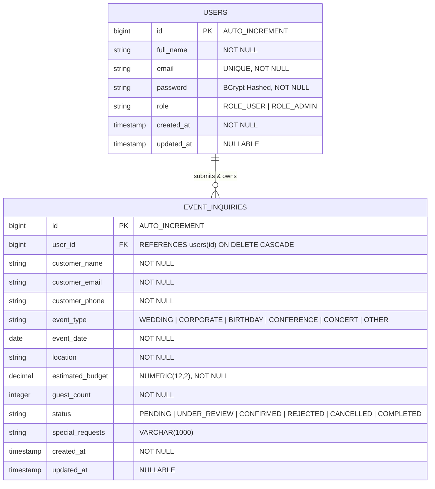

# 📘 Event Inquiry Management API — Comprehensive Technical Documentation

---

## 📄 Executive Summary & Assessment Context

The **Event Inquiry Management API** is a enterprise-grade RESTful backend application developed using **Java 17**, **Spring Boot 3.2**, **Spring Security (JWT)**, **Spring Data JPA/Hibernate**, and **PostgreSQL**.

Designed specifically for event management organizations, this system handles customer inquiry submissions for event bookings (weddings, corporate summits, birthdays, conferences, concerts) while offering role-based administrative management, workflow tracking, and strict server-side **Insecure Direct Object Reference (IDOR)** protection.

### Primary Objectives Met:
1. **Stateless Authentication**: JWT-based session handling using Spring Security 6.
2. **Role-Based Access Control (RBAC)**: Fine-grained permissions separating `ROLE_USER` (customers) from `ROLE_ADMIN` (management officers).
3. **Strict Resource Ownership Protection**: Server-side authorization preventing standard users from accessing, modifying, or deleting other users' inquiries via ID manipulation.
4. **Data Integrity & Persistence**: Relational mapping with JPA/Hibernate supporting both PostgreSQL (Production/Docker) and H2 (Local Development).
5. **Standardized API Contracts**: Uniform HTTP response formats, request DTO validations, standard status codes, and `@RestControllerAdvice` error structures.

---

## 🛠️ Technology Stack & Environment

| Component | Technology | Version | Purpose |
| :--- | :--- | :--- | :--- |
| **Language** | Java OpenJDK / Temurin / JBR | `17` / `21` | Core Programming Language |
| **Framework** | Spring Boot | `3.2.5` | Application Framework & Dependency Injection |
| **Security** | Spring Security | `6.2.4` | Authentication, Access Controls & Web Security |
| **Token Auth** | JJWT (io.jsonwebtoken) | `0.12.5` | JSON Web Token Generation, Claims & Validation |
| **Persistence** | Spring Data JPA / Hibernate | `6.4.4` | Object-Relational Mapping (ORM) & Repositories |
| **Database** | PostgreSQL | `16.0` | Primary Relational Production Database |
| **Dev Database** | H2 Database Engine | `2.2.224` | In-Memory Database for Rapid Testing |
| **Validation** | Jakarta Bean Validation | `3.0.2` | Input DTO Validation (`@NotBlank`, `@Email`, etc.) |
| **API Docs** | SpringDoc OpenAPI / Swagger UI | `2.5.0` | Interactive OpenAPI 3.0 API Documentation |
| **Containerization**| Docker & Docker Compose | `3.8` | Multi-container orchestration (Postgres + API) |
| **Build Tool** | Apache Maven | `3.9.6` | Dependency Management & Packaging |

---

## 🏛️ Application Architecture & Layering

The application follows a **Clean Layered Architecture**, enforcing clear separation of concerns:

```
┌─────────────────────────────────────────────────────────────────────────┐
│                        HTTP / REST Clients                              │
│              (Postman, Web Frontends, Swagger UI)                       │
└────────────────────────────────────┬────────────────────────────────────┘
                                     │ JSON Requests / Bearer Token
                                     ▼
┌─────────────────────────────────────────────────────────────────────────┐
│                       REST Controllers Layer                            │
│           (com.eventmanagement.api.controller)                          │
│     - AuthController, EventInquiryController                            │
│     - Handles DTO binding, Swagger annotations, HTTP responses          │
└────────────────────────────────────┬────────────────────────────────────┘
                                     │
                                     ▼
┌─────────────────────────────────────────────────────────────────────────┐
│                      Spring Security Filter Chain                       │
│           (com.eventmanagement.api.security & config)                   │
│     - JwtAuthenticationFilter, JwtTokenProvider, SecurityConfig         │
│     - Intercepts requests, parses JWT, sets SecurityContext              │
└────────────────────────────────────┬────────────────────────────────────┘
                                     │
                                     ▼
┌─────────────────────────────────────────────────────────────────────────┐
│                          Service Layer                                  │
│         (com.eventmanagement.api.service / service.impl)                │
│     - AuthServiceImpl, EventInquiryServiceImpl, UserServiceImpl         │
│     - Business logic, IDOR ownership validation, DTO mapping            │
└────────────────────────────────────┬────────────────────────────────────┘
                                     │
                                     ▼
┌─────────────────────────────────────────────────────────────────────────┐
│                       Repository Layer (JPA)                            │
│            (com.eventmanagement.api.repository)                         │
│     - UserRepository, EventInquiryRepository                            │
│     - Interacts with Hibernate ORM & Data Source                        │
└────────────────────────────────────┬────────────────────────────────────┘
                                     │
                                     ▼
┌─────────────────────────────────────────────────────────────────────────┐
│                       Database Engine                                   │
│            (PostgreSQL 16 Container / H2 In-Memory)                     │
└─────────────────────────────────────────────────────────────────────────┘
```

---

## 📊 Database Design & Entity Relationship

### ER Diagram (Mermaid)



### Table Specifications

#### 1. `users` Table
- **Primary Key**: `id` (`BIGINT`, Auto-increment)
- **Unique Constraint**: `email` (Case-insensitive unique login identifier)
- **Security Constraint**: `password` column stores 60-character BCrypt hash string (never plaintext).
- **Role Constraint**: Enforced Enum string value (`ROLE_USER` or `ROLE_ADMIN`).

#### 2. `event_inquiries` Table
- **Primary Key**: `id` (`BIGINT`, Auto-increment)
- **Foreign Key**: `user_id` referencing `users(id)` with `ON DELETE CASCADE`.
- **Enumerations**:
  - `event_type`: `WEDDING`, `CORPORATE`, `BIRTHDAY`, `CONFERENCE`, `CONCERT`, `ANNIVERSARY`, `OTHER`.
  - `status`: `PENDING`, `UNDER_REVIEW`, `CONFIRMED`, `REJECTED`, `CANCELLED`, `COMPLETED`.
- **Indexes**:
  - `idx_inquiries_user_id`: Fast lookup for user-owned inquiry lists (`GET /api/v1/inquiries/my`).
  - `idx_inquiries_status`: Fast administrative filtering by status.
  - `idx_inquiries_event_type`: Fast administrative filtering by event type.

---

## 🔒 Security Architecture & IDOR Protection

### 1. Authentication & Token Processing
- **Password Hashing**: User registration hashes plaintext passwords using `BCryptPasswordEncoder` with standard strength work factor (10).
- **JWT Minting**: `JwtTokenProvider.generateToken(Authentication authentication)` generates a JWT string containing:
  - Subject (`sub`): User email address
  - Claim (`roles`): Authority string (`ROLE_USER` or `ROLE_ADMIN`)
  - Issue Date (`iat`): Current System Timestamp
  - Expiration Date (`exp`): Expiration timestamp (Default: 24 hours)
- **Token Verification**: `JwtAuthenticationFilter` executes per request, extracting the Bearer token from the `Authorization` header, validating signature, loading `UserDetails`, and setting the Spring Security `SecurityContext`.

### 2. Insecure Direct Object Reference (IDOR) Protection
IDOR occurs when an application exposes a reference to an internal implementation object (e.g. inquiry ID `42`) without checking if the requester has permission to access that specific object.

#### Implementation Proof (`EventInquiryServiceImpl.java`):
```java
@Override
@Transactional(readOnly = true)
public EventInquiryResponse getInquiryById(Long id, String currentUserEmail) {
    User currentUser = getUserByEmail(currentUserEmail);
    EventInquiry inquiry = getInquiryEntityById(id);

    // Enforce strict resource authorization
    verifyOwnershipOrAdmin(inquiry, currentUser);

    return mapToResponse(inquiry);
}

private void verifyOwnershipOrAdmin(EventInquiry inquiry, User currentUser) {
    boolean isAdmin = currentUser.getRole() == Role.ROLE_ADMIN;
    boolean isOwner = Objects.equals(inquiry.getUser().getId(), currentUser.getId());

    if (!isAdmin && !isOwner) {
        throw new UnauthorizedAccessException("Access denied: You do not have permission to access or modify this inquiry.");
    }
}
```

#### Behavioral Security Result:
- **Scenario A**: `john@example.com` (Owner of inquiry ID `1`) requests `GET /api/v1/inquiries/1` -> **`HTTP 200 OK`**.
- **Scenario B**: `jane@example.com` (User 2) requests `GET /api/v1/inquiries/1` -> **`HTTP 403 Forbidden`** with error message: *"Access denied: You do not have permission to access or modify this inquiry."*
- **Scenario C**: `admin@example.com` (`ROLE_ADMIN`) requests `GET /api/v1/inquiries/1` -> **`HTTP 200 OK`** (Admins possess global audit access).

---

## 📡 REST API Reference Specification

### Authentication Endpoints

#### `POST /api/v1/auth/register`
Creates a new user account.
- **Request Body**:
  ```json
  {
    "fullName": "Alice Wonderland",
    "email": "alice@example.com",
    "password": "password123",
    "adminRole": false
  }
  ```
- **Response (`201 Created`)**:
  ```json
  {
    "id": 4,
    "fullName": "Alice Wonderland",
    "email": "alice@example.com",
    "role": "ROLE_USER",
    "createdAt": "2026-07-30T16:15:00"
  }
  ```

#### `POST /api/v1/auth/login`
Authenticates credentials and returns a Bearer JWT token.
- **Request Body**:
  ```json
  {
    "email": "john@example.com",
    "password": "user123"
  }
  ```
- **Response (`200 OK`)**:
  ```json
  {
    "accessToken": "eyJhbGciOiJIUzI1NiJ9...",
    "tokenType": "Bearer",
    "user": {
      "id": 2,
      "fullName": "John Doe",
      "email": "john@example.com",
      "role": "ROLE_USER",
      "createdAt": "2026-07-30T16:00:00"
    }
  }
  ```

#### `GET /api/v1/auth/me`
Retrieves the profile of the currently authenticated user.
- **Headers**: `Authorization: Bearer <JWT_TOKEN>`
- **Response (`200 OK`)**: Returns current user profile details.

---

### Event Inquiry Endpoints

#### `POST /api/v1/inquiries`
Submits a new event inquiry attached to the logged-in user.
- **Headers**: `Authorization: Bearer <JWT_TOKEN>`
- **Request Body**:
  ```json
  {
    "customerName": "John Doe",
    "customerEmail": "john@example.com",
    "customerPhone": "+15550192834",
    "eventType": "WEDDING",
    "eventDate": "2026-11-20",
    "location": "Grand Hyatt Ballroom, Chicago",
    "estimatedBudget": 18500.00,
    "guestCount": 120,
    "specialRequests": "Special floral stage setup requested."
  }
  ```
- **Response (`201 Created`)**: Returns created `EventInquiryResponse` with initial status `PENDING`.

#### `GET /api/v1/inquiries/my`
Retrieves a paginated list of inquiries submitted by the authenticated user.
- **Headers**: `Authorization: Bearer <JWT_TOKEN>`
- **Query Params**: `page` (default 0), `size` (default 10), `sortBy` (default `createdAt`), `sortDir` (default `desc`).
- **Response (`200 OK`)**: `PagedResponse<EventInquiryResponse>`.

#### `GET /api/v1/inquiries/{id}`
Fetches a specific inquiry by ID.
- **Headers**: `Authorization: Bearer <JWT_TOKEN>`
- **Access Rule**: Owner or `ROLE_ADMIN` only. (Others receive `403 Forbidden`).
- **Response (`200 OK`)**: `EventInquiryResponse`.

#### `PUT /api/v1/inquiries/{id}`
Updates an existing inquiry's details.
- **Headers**: `Authorization: Bearer <JWT_TOKEN>`
- **Access Rule**: Owner or `ROLE_ADMIN` only.
- **Response (`200 OK`)**: Updated `EventInquiryResponse`.

#### `PATCH /api/v1/inquiries/{id}/status`
Updates an inquiry processing status.
- **Headers**: `Authorization: Bearer <ADMIN_JWT_TOKEN>`
- **Access Rule**: `ROLE_ADMIN` only. (Standard users receive `403 Forbidden`).
- **Request Body**:
  ```json
  {
    "status": "CONFIRMED"
  }
  ```
- **Response (`200 OK`)**: Updated `EventInquiryResponse`.

#### `GET /api/v1/inquiries`
Lists and filters all system inquiries across all users.
- **Headers**: `Authorization: Bearer <ADMIN_JWT_TOKEN>`
- **Access Rule**: `ROLE_ADMIN` only.
- **Query Params**: `status`, `eventType`, `page`, `size`, `sortBy`, `sortDir`.
- **Response (`200 OK`)**: `PagedResponse<EventInquiryResponse>`.

#### `DELETE /api/v1/inquiries/{id}`
Deletes an inquiry by ID.
- **Headers**: `Authorization: Bearer <JWT_TOKEN>`
- **Access Rule**: Owner or `ROLE_ADMIN` only.
- **Response (`204 No Content`)**.

---

## ⚡ Unified Global Error Response Format

When any validation failure or exception occurs, `GlobalExceptionHandler` returns a standardized JSON payload:

```json
{
  "timestamp": "2026-07-30T16:15:30.123456",
  "status": 400,
  "error": "Bad Request",
  "message": "Validation failed for one or more fields",
  "path": "/api/v1/inquiries",
  "validationErrors": {
    "eventDate": "Event date must be in the future",
    "customerEmail": "Invalid email format",
    "estimatedBudget": "Estimated budget must be at least 1.00"
  }
}
```

---

## 🧪 Testing Strategy & Execution Verification

The project includes unit, controller, integration, and security test classes using **JUnit 5**, **Mockito**, and **Spring Security Test**.

### Test Suite Summary (`./mvnw test`)

```
[INFO] Running com.eventmanagement.api.EventInquiryApiApplicationTests
[INFO] Tests run: 1, Failures: 0, Errors: 0, Skipped: 0 - Context Loads
[INFO] Running com.eventmanagement.api.controller.AuthControllerTest
[INFO] Tests run: 2, Failures: 0, Errors: 0, Skipped: 0 - MockMvc Auth Tests
[INFO] Running com.eventmanagement.api.security.SecurityAuthorizationTest
[INFO] Tests run: 4, Failures: 0, Errors: 0, Skipped: 0 - IDOR & Role Security Tests
[INFO] Running com.eventmanagement.api.service.EventInquiryServiceTest
[INFO] Tests run: 2, Failures: 0, Errors: 0, Skipped: 0 - Business Logic Unit Tests

[INFO] ------------------------------------------------------------------------
[INFO] BUILD SUCCESS
[INFO] Total time:  42.486 s
[INFO] Finished at: 2026-07-30T16:08:11+05:30
[INFO] ------------------------------------------------------------------------
```

---

## 🚀 Execution & Deployment Options

### 1. Local Run (Dev Profile with Embedded H2)
```bash
cd C:\Users\indrajit\Desktop\event-inquiry-api
.\mvnw.cmd spring-boot:run "-Dspring-boot.run.profiles=dev"
```
- App Server: `http://localhost:8080`
- Swagger UI: `http://localhost:8080/swagger-ui.html`
- H2 Console: `http://localhost:8080/h2-console` (`jdbc:h2:mem:eventinquirydb`, user `sa`, blank password)

### 2. Docker Compose (PostgreSQL 16 Container)
```bash
docker-compose up --build
```

### 3. Deploy on Railway
1. Push repository to GitHub.
2. Link project on [Railway](https://railway.com/new).
3. Railway automatically builds the container using `railway.json` and the dynamic `$PORT` `Dockerfile`.

---

## 🔑 Pre-configured Seed Credentials

The application automatically seeds data upon launch for testing:

| User Type | Email | Password | Role | Privileges |
| :--- | :--- | :--- | :--- | :--- |
| **Admin User** | `admin@example.com` | `admin123` | `ROLE_ADMIN` | View/manage all inquiries & update status |
| **Customer 1** | `john@example.com` | `user123` | `ROLE_USER` | Create & view own inquiries |
| **Customer 2** | `jane@example.com` | `user123` | `ROLE_USER` | Create & view own inquiries (used for IDOR tests) |

---

## 📄 Repository & Version Control
- **GitHub Repository**: [https://github.com/SHAW258/event-inquiry-api](https://github.com/SHAW258/event-inquiry-api)
- **Local Location**: `C:\Users\indrajit\Desktop\event-inquiry-api`
