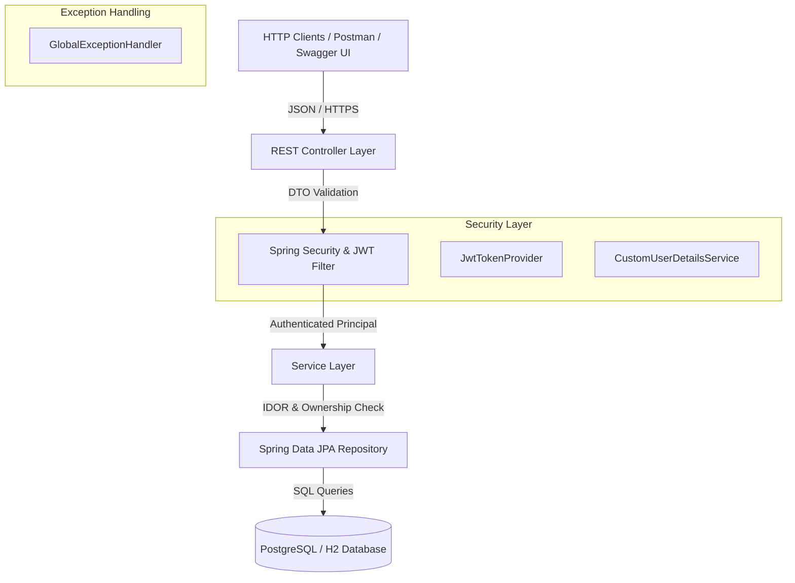
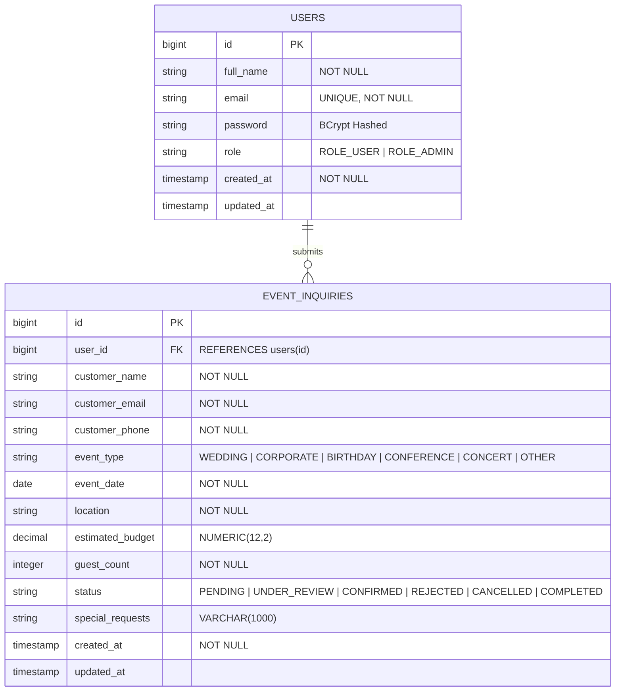

# 🎪 Event Inquiry Management API

[](https://www.oracle.com/java/)
[](https://spring.io/projects/spring-boot)
[](https://spring.io/projects/spring-security)
[](https://jwt.io/)
[](https://www.postgresql.org/)
[](LICENSE)

An enterprise-grade, high-performance RESTful API built with **Java 17**, **Spring Boot 3.2**, **Spring Data JPA**, **Spring Security (JWT)**, and **PostgreSQL**. Designed for event management platforms to handle user registration, role-based access control (USER / ADMIN), event inquiry submissions, status workflows, and strict server-side **Insecure Direct Object Reference (IDOR)** prevention.

---

## 📑 Table of Contents
- [Executive Overview](#-executive-overview)
- [System Architecture](#-system-architecture)
- [Database ER Diagram & Schema Design](#-database-er-diagram--schema-design)
- [Authentication & Security Engineering](#-authentication--security-engineering)
  - [JWT Token Lifecycle](#1-jwt-token-lifecycle)
  - [IDOR Protection Mechanism](#2-idor-protection-mechanism)
- [API Endpoints Reference](#-api-endpoints-reference)
- [Quick Start Guide](#-quick-start-guide)
- [Postman Collection & Swagger UI](#-postman-collection--swagger-ui)
- [Automated Testing & Security Validation](#-automated-testing--security-validation)
- [Deployment Guide (Docker & Railway)](#-deployment-guide-docker--railway)

---

## 🏛️ Executive Overview

The **Event Inquiry Management API** serves as a centralized backend service for customers to submit event inquiries (weddings, corporate conferences, birthdays, concerts) and track inquiry progress while enabling administration teams to review, update status, and manage inquiries across the system.

### Key Capabilities:
- **Role-Based Access Control (RBAC)**: Enforces distinct access privileges for standard customers (`ROLE_USER`) and system administrators (`ROLE_ADMIN`).
- **Resource Ownership Verification**: Eliminates IDOR vulnerabilities by programmatically verifying resource ownership prior to fulfilling requests.
- **Flexible Persistence**: Production-ready PostgreSQL container support paired with H2 zero-configuration fallback for rapid local evaluation.
- **OpenAPI 3.0 & Swagger Integration**: Fully interactive API documentation with Bearer JWT security scheme support.

---

## 🏗️ System Architecture

The application adopts a **Clean Layered Architecture** adhering to SOLID design principles:



### Layer Responsibilities:
1. **Controller Layer (`com.eventmanagement.api.controller`)**: Manages HTTP request endpoints, DTO binding, and Swagger/OpenAPI documentation.
2. **Security Layer (`com.eventmanagement.api.security` & `config`)**: Handles JWT parsing, token validation, password encoding (BCrypt), and CORS/CSRF policies.
3. **Service Layer (`com.eventmanagement.api.service`)**: Implements core business logic, status state transitions, and resource ownership verification.
4. **Repository Layer (`com.eventmanagement.api.repository`)**: Interfaces with PostgreSQL database using JPA spring data repository patterns.
5. **Exception Handler (`com.eventmanagement.api.exception`)**: Intercepts domain exceptions and validation errors to return uniform standard JSON error payloads (`ApiErrorResponse`).

---

## 📊 Database ER Diagram & Schema Design

### Entity-Relationship Diagram (Mermaid)



### Database Schema Table Definitions

#### `users` Table
| Column Name | Data Type | Constraints | Description |
| :--- | :--- | :--- | :--- |
| `id` | `BIGINT` | `PRIMARY KEY`, `AUTO_INCREMENT` | Unique identifier for user account |
| `full_name` | `VARCHAR(100)` | `NOT NULL` | Customer or Admin full name |
| `email` | `VARCHAR(255)` | `UNIQUE`, `NOT NULL` | User email used as login username |
| `password` | `VARCHAR(255)` | `NOT NULL` | BCrypt-encrypted password hash |
| `role` | `VARCHAR(20)` | `NOT NULL` | Enum: `ROLE_USER`, `ROLE_ADMIN` |
| `created_at` | `TIMESTAMP` | `NOT NULL`, `DEFAULT CURRENT_TIMESTAMP` | Record creation timestamp |
| `updated_at` | `TIMESTAMP` | `NULLABLE` | Record modification timestamp |

#### `event_inquiries` Table
| Column Name | Data Type | Constraints | Description |
| :--- | :--- | :--- | :--- |
| `id` | `BIGINT` | `PRIMARY KEY`, `AUTO_INCREMENT` | Unique inquiry tracking ID |
| `user_id` | `BIGINT` | `FOREIGN KEY -> users(id)` | Owner user account reference |
| `customer_name` | `VARCHAR(100)` | `NOT NULL` | Primary contact name |
| `customer_email` | `VARCHAR(255)` | `NOT NULL` | Primary contact email |
| `customer_phone` | `VARCHAR(30)` | `NOT NULL` | Contact phone number |
| `event_type` | `VARCHAR(30)` | `NOT NULL` | Enum: `WEDDING`, `CORPORATE`, `BIRTHDAY`, etc. |
| `event_date` | `DATE` | `NOT NULL` | Scheduled date of event |
| `location` | `VARCHAR(255)` | `NOT NULL` | Event venue address/city |
| `estimated_budget`| `NUMERIC(12,2)`| `NOT NULL` | Estimated budget allocation |
| `guest_count` | `INT` | `NOT NULL` | Expected number of attendees |
| `status` | `VARCHAR(20)` | `NOT NULL` | Enum: `PENDING`, `CONFIRMED`, `CANCELLED`, etc. |
| `special_requests`| `VARCHAR(1000)`| `NULLABLE` | Catering, AV, or stage setup notes |
| `created_at` | `TIMESTAMP` | `NOT NULL`, `DEFAULT CURRENT_TIMESTAMP` | Submission timestamp |
| `updated_at` | `TIMESTAMP` | `NULLABLE` | Status update timestamp |

---

## 🔒 Authentication & Security Engineering

### 1. JWT Token Lifecycle
1. **Credentials Verification**: `/api/v1/auth/login` verifies user email and password using `BCryptPasswordEncoder`.
2. **Token Minting**: `JwtTokenProvider` generates an HMAC SHA-256 signed JWT string containing subject (`email`), issue timestamp, expiration (24h), and granted authorities (`roles`).
3. **Filter Authentication**: `JwtAuthenticationFilter` intercepts incoming requests, verifies token signature, and sets the `Authentication` object inside `SecurityContextHolder`.

### 2. IDOR Protection Mechanism
To guarantee that **one user cannot access another user's inquiry by modifying an ID parameter in the URL**:
- Every resource retrieval, edit, and deletion endpoint (`GET /api/v1/inquiries/{id}`, `PUT /api/v1/inquiries/{id}`, `DELETE /api/v1/inquiries/{id}`) calls the internal ownership verification check:

```java
private void verifyOwnershipOrAdmin(EventInquiry inquiry, User currentUser) {
    boolean isAdmin = currentUser.getRole() == Role.ROLE_ADMIN;
    boolean isOwner = Objects.equals(inquiry.getUser().getId(), currentUser.getId());

    if (!isAdmin && !isOwner) {
        throw new UnauthorizedAccessException("Access denied: You do not have permission to access or modify this inquiry.");
    }
}
```

If `User A` attempts to request `GET /api/v1/inquiries/42` (owned by `User B`), the service throws `UnauthorizedAccessException`, producing an HTTP `403 Forbidden` response.

---

## 🚀 API Endpoints Reference

### Public & Authentication APIs
| Method | Endpoint | Access Level | Description | Status Code |
| :--- | :--- | :--- | :--- | :--- |
| `POST` | `/api/v1/auth/register` | Public | Register new user account | `201 Created` |
| `POST` | `/api/v1/auth/login` | Public | Authenticate user & issue JWT | `200 OK` |
| `GET` | `/api/v1/auth/me` | Authenticated | Fetch current user profile | `200 OK` |

### Event Inquiry Management APIs
| Method | Endpoint | Access Level | Description | Status Code |
| :--- | :--- | :--- | :--- | :--- |
| `POST` | `/api/v1/inquiries` | `ROLE_USER` / `ADMIN` | Create a new event inquiry | `201 Created` |
| `GET` | `/api/v1/inquiries/my` | `ROLE_USER` / `ADMIN` | Fetch user's own inquiries (Paginated) | `200 OK` |
| `GET` | `/api/v1/inquiries/{id}` | Owner or `ADMIN` | Fetch specific inquiry by ID (IDOR Protected) | `200 OK` |
| `PUT` | `/api/v1/inquiries/{id}` | Owner or `ADMIN` | Update inquiry details (IDOR Protected) | `200 OK` |
| `DELETE` | `/api/v1/inquiries/{id}` | Owner or `ADMIN` | Delete inquiry by ID (IDOR Protected) | `204 No Content` |
| `GET` | `/api/v1/inquiries` | `ROLE_ADMIN` Only | List & filter all inquiries across system | `200 OK` |
| `PATCH` | `/api/v1/inquiries/{id}/status` | `ROLE_ADMIN` Only | Update inquiry processing status | `200 OK` |

---

## ⚡ Quick Start Guide

Detailed step-by-step installation instructions can be found in **[SETUP.md](file:///C:/Users/indrajit/Desktop/event-inquiry-api/SETUP.md)**.

### Quick Run with Embedded H2 Database (Dev Profile):
```bash
git clone https://github.com/SHAW258/event-inquiry-api.git
cd event-inquiry-api
./mvnw spring-boot:run "-Dspring-boot.run.profiles=dev"
```

### Pre-configured Test Accounts:
- **Admin User**: `admin@example.com` / `admin123` (`ROLE_ADMIN`)
- **Standard User 1**: `john@example.com` / `user123` (`ROLE_USER`)
- **Standard User 2**: `jane@example.com` / `user123` (`ROLE_USER`)

---

## 📮 Postman Collection & Swagger UI

### 1. Interactive Swagger UI
Open your browser while the app is running:
- **Swagger Documentation**: [http://localhost:8080/swagger-ui.html](http://localhost:8080/swagger-ui.html)
- **OpenAPI JSON**: [http://localhost:8080/v3/api-docs](http://localhost:8080/v3/api-docs)

### 2. Postman Collection
Import the pre-configured collection file located at:
[`Event_Inquiry_Management_API.postman_collection.json`](file:///C:/Users/indrajit/Desktop/event-inquiry-api/Event_Inquiry_Management_API.postman_collection.json)

*Note: Executing the login requests automatically sets the `{{jwt_token}}` collection variable.*

---

## 🧪 Automated Testing & Security Validation

Run the full suite of unit, integration, and security tests:
```bash
./mvnw clean test
```

### Verified Test Suites:
- `SecurityAuthorizationTest`: Verifies IDOR prevention, 403 Forbidden behavior, and ADMIN endpoint locks.
- `AuthControllerTest`: Validates registration, JWT issuance, and login response formats.
- `EventInquiryServiceTest`: Tests inquiry business logic and authorization rules.

---

## 🌐 Deployment Guide (Docker & Railway)

### 1. Docker Compose (PostgreSQL)
```bash
docker-compose up --build
```

### 2. Deploy to Railway
1. Push repository to GitHub.
2. Connect repository on [Railway](https://railway.com/new).
3. Railway automatically detects `railway.json` and builds the Docker container.

---

## 📄 License
Released under the [Apache 2.0 License](LICENSE).
